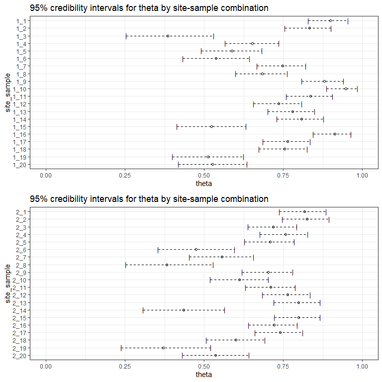
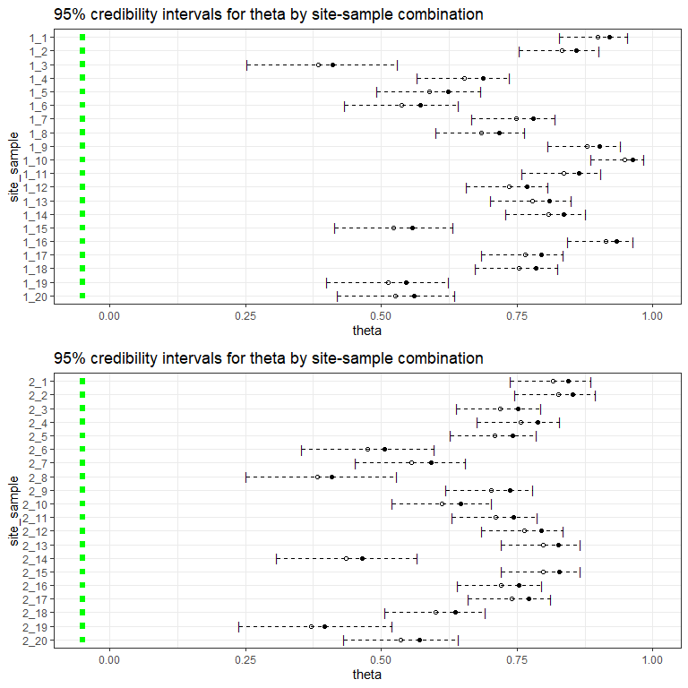

msocc is an R package for fitting and analyzing computationally
efficient Bayesian multi-scale occupancy models. Its development was
motivated by the use of environmental DNA (eDNA) for the monitoring of
pathogens, parasites, and invasive species in the Yellowstone River.
Consequently, the language in this package assumes this context. For
more information on eDNA, see [Improved detection of rare, endangered
and invasive trout in using a new large‐volume sampling method for eDNA
capture](https://onlinelibrary.wiley.com/doi/epdf/10.1002/edn3.23) or
[Adding invasive species biosurveillance to the U.S. Geological Survey
streamgage
network](https://esajournals.onlinelibrary.wiley.com/doi/epdf/10.1002/ecs2.2843).

# Installation instructions

This package is still under development, but can be installed through
GitHub using the following code:

``` r
install.packages('devtools') # only needed if devtools is not currently installed
devtools::install_github('StrattonCh/msocc')
```

# Contact information

Christian Stratton (<christianstratton@montana.edu>) developed this R
package.

# Usage

The heavy lifting for this package is done with `msocc_mod`, which fits
the models. The results of this function are then passed to
`posterior_summary` to numerically summarize the posterior distribution
and `cred_plot` to visually summarize it. Additionally, this package
provides tools to simulate data from multi-scale occupancy models.

## Simulated examples

### Constant psi, theta, and p

To showcase the utility of this package, we begin with a simple example
where there are 10 sites of interest, from which we collect 5 samples
each and analyze 5 PCR replicates for the presence of the target DNA. To
simulate data consistent with this structure, we use the following code.

``` r
sim <- msocc_sim(M = 10, J = 5, K = 5, psi = 0.8, theta = 0.75, p = 0.9)
str(sim)
```

    List of 5
     $ resp  :'data.frame': 50 obs. of  7 variables:
      ..$ site  : Factor w/ 10 levels "1","2","3","4",..: 1 1 1 1 1 2 2 2 2 2 ...
      ..$ sample: Factor w/ 5 levels "1","2","3","4",..: 1 2 3 4 5 1 2 3 4 5 ...
      ..$ pcr1  : int [1:50] 1 0 0 1 1 1 1 1 0 1 ...
      ..$ pcr2  : int [1:50] 1 0 0 1 0 1 1 1 0 1 ...
      ..$ pcr3  : int [1:50] 1 0 0 1 1 1 1 1 0 1 ...
      ..$ pcr4  : int [1:50] 1 0 0 1 1 1 1 1 0 1 ...
      ..$ pcr5  : int [1:50] 1 0 0 1 1 1 1 1 0 1 ...
     $ site  :'data.frame': 10 obs. of  1 variable:
      ..$ site: Factor w/ 10 levels "1","2","3","4",..: 1 2 3 4 5 6 7 8 9 10
     $ sample:'data.frame': 50 obs. of  2 variables:
      ..$ site  : Factor w/ 10 levels "1","2","3","4",..: 1 1 1 1 1 2 2 2 2 2 ...
      ..$ sample: Factor w/ 5 levels "1","2","3","4",..: 1 2 3 4 5 1 2 3 4 5 ...
     $ rep   :'data.frame': 250 obs. of  3 variables:
      ..$ site  : Factor w/ 10 levels "1","2","3","4",..: 1 1 1 1 1 1 1 1 1 1 ...
      ..$ sample: Factor w/ 5 levels "1","2","3","4",..: 1 1 1 1 1 2 2 2 2 2 ...
      ..$ rep   : Factor w/ 5 levels "1","2","3","4",..: 1 2 3 4 5 1 2 3 4 5 ...
     $ params:List of 6
      ..$ psi  : num 0.8
      ..$ theta: num 0.75
      ..$ p    : num 0.9
      ..$ z    : int [1:10] 1 1 1 1 1 1 1 1 1 0
      ..$ a    : int [1:50] 1 0 0 1 1 1 1 1 0 1 ...
      ..$ z.vec: int [1:50] 1 1 1 1 1 1 1 1 1 1 ...

To generate these data, we have to specify all the occupancy parameters.
Here, we chose to set the probability of presence at the site to be 0.8,
the probability of occurence in the sample (conditional on presence at
the site) to be 0.75, and the probability of detection in the replicate
(conditional on occurence in the sample) to be 0.9. The simulated data
take the following form:

``` r
head(sim$resp)
```

``` 
  site sample pcr1 pcr2 pcr3 pcr4 pcr5
1    1      1    1    1    1    1    1
2    1      2    0    0    0    0    0
3    1      3    0    0    0    0    0
4    1      4    1    1    1    1    1
5    1      5    1    0    1    1    1
6    2      1    1    1    1    1    1
```

To fit a model to these data, we use the `msocc_mod` function.

``` r
mod <- msocc_mod(wide_data = sim$resp,
                 site = list(model = ~ 1, cov_tbl = sim$site),
                 sample = list(model = ~ 1, cov_tbl = sim$sample),
                 rep = list(model = ~ 1, cov_tbl = sim$rep),
                 progress = F)
```

Within `msocc_mod`, we need to specify the `site`, `sample`, and `rep`
lists which define the models to be fit at each level of the hierarchy.
In this case, we are fitting only an intercept at each level which
implies a constant probability of presence, occurence, and detection.
For numerical summaries of this model, we can use `posterior_summary`.
First, an overall summary.

``` r
posterior_summary(mod, print = T)
```

    Overall summary of occupancy given by posterior medians: 

``` 
   site sample rep       psi     theta         p
1     1      1   1 0.8545568 0.6811052 0.9131756
2     2      1   1 0.8545568 0.6811052 0.9131756
3     3      1   1 0.8545568 0.6811052 0.9131756
4     4      1   1 0.8545568 0.6811052 0.9131756
5     5      1   1 0.8545568 0.6811052 0.9131756
6     6      1   1 0.8545568 0.6811052 0.9131756
7     7      1   1 0.8545568 0.6811052 0.9131756
8     8      1   1 0.8545568 0.6811052 0.9131756
9     9      1   1 0.8545568 0.6811052 0.9131756
10   10      1   1 0.8545568 0.6811052 0.9131756
```

By default, `posterior_summary` returns only the unique combinations of
psi, theta, and p, but always returns a row for each site. Based on
these estimates, our model returned estimates consistent with the
parameter values we used to generate the data. For a more in-depth look
at each of the site, sample, and replicate levels and a description of
uncertainty, we can specify the `level` in `posterior_summary`.

``` r
posterior_summary(mod, level = 'site', print = T)
```

    Posterior summary of occupancy at the site: 

``` 
   site    median      mean     0.025     0.975
1     1 0.8545568 0.8380095 0.6027542 0.9839527
2     2 0.8545568 0.8380095 0.6027542 0.9839527
3     3 0.8545568 0.8380095 0.6027542 0.9839527
4     4 0.8545568 0.8380095 0.6027542 0.9839527
5     5 0.8545568 0.8380095 0.6027542 0.9839527
6     6 0.8545568 0.8380095 0.6027542 0.9839527
7     7 0.8545568 0.8380095 0.6027542 0.9839527
8     8 0.8545568 0.8380095 0.6027542 0.9839527
9     9 0.8545568 0.8380095 0.6027542 0.9839527
10   10 0.8545568 0.8380095 0.6027542 0.9839527
```

``` r
posterior_summary(mod, level = 'sample', print = T)
```

    Posterior summary of occupancy at the sample: 

``` 
   site sample rep    median      mean    0.025     0.975
1     1      1   1 0.6811052 0.6786277 0.541184 0.8046176
2     2      1   1 0.6811052 0.6786277 0.541184 0.8046176
3     3      1   1 0.6811052 0.6786277 0.541184 0.8046176
4     4      1   1 0.6811052 0.6786277 0.541184 0.8046176
5     5      1   1 0.6811052 0.6786277 0.541184 0.8046176
6     6      1   1 0.6811052 0.6786277 0.541184 0.8046176
7     7      1   1 0.6811052 0.6786277 0.541184 0.8046176
8     8      1   1 0.6811052 0.6786277 0.541184 0.8046176
9     9      1   1 0.6811052 0.6786277 0.541184 0.8046176
10   10      1   1 0.6811052 0.6786277 0.541184 0.8046176
```

``` r
posterior_summary(mod, level = 'rep', print = T)
```

    Posterior summary of detection in a replicate: 

``` 
   site sample rep    median      mean     0.025     0.975
1     1      1   1 0.9131756 0.9106892 0.8603062 0.9487432
2     2      1   1 0.9131756 0.9106892 0.8603062 0.9487432
3     3      1   1 0.9131756 0.9106892 0.8603062 0.9487432
4     4      1   1 0.9131756 0.9106892 0.8603062 0.9487432
5     5      1   1 0.9131756 0.9106892 0.8603062 0.9487432
6     6      1   1 0.9131756 0.9106892 0.8603062 0.9487432
7     7      1   1 0.9131756 0.9106892 0.8603062 0.9487432
8     8      1   1 0.9131756 0.9106892 0.8603062 0.9487432
9     9      1   1 0.9131756 0.9106892 0.8603062 0.9487432
10   10      1   1 0.9131756 0.9106892 0.8603062 0.9487432
```

### Constant psi, theta as a function of covariates, constant p

Next, we consider the case where the sample level occurence probability
is a function of covariates. First, we generate the data.

``` r
sim <- msocc_sim(M = 10, J = 20, K = 5, psi = 0.8, p = 0.9,
                 sample.df = data.frame(site = rep(1:10, each = 20),
                                        sample = rep(1:20, 10),
                                        x = rnorm(200)),
                 sample.mod = ~x,
                 alpha = c(1,1))
str(sim)
```

    List of 5
     $ resp  :'data.frame': 200 obs. of  7 variables:
      ..$ site  : Factor w/ 10 levels "1","2","3","4",..: 1 1 1 1 1 1 1 1 1 1 ...
      ..$ sample: Factor w/ 20 levels "1","2","3","4",..: 1 2 3 4 5 6 7 8 9 10 ...
      ..$ pcr1  : int [1:200] 0 0 0 0 0 0 0 0 0 0 ...
      ..$ pcr2  : int [1:200] 0 0 0 0 0 0 0 0 0 0 ...
      ..$ pcr3  : int [1:200] 0 0 0 0 0 0 0 0 0 0 ...
      ..$ pcr4  : int [1:200] 0 0 0 0 0 0 0 0 0 0 ...
      ..$ pcr5  : int [1:200] 0 0 0 0 0 0 0 0 0 0 ...
     $ site  :'data.frame': 10 obs. of  1 variable:
      ..$ site: Factor w/ 10 levels "1","2","3","4",..: 1 2 3 4 5 6 7 8 9 10
     $ sample:'data.frame': 200 obs. of  3 variables:
      ..$ site  : Factor w/ 10 levels "1","2","3","4",..: 1 1 1 1 1 1 1 1 1 1 ...
      ..$ sample: Factor w/ 20 levels "1","2","3","4",..: 1 2 3 4 5 6 7 8 9 10 ...
      ..$ x     : num [1:200] 1.451 0.812 -1.362 -0.213 -0.496 ...
     $ rep   :'data.frame': 1000 obs. of  3 variables:
      ..$ site  : Factor w/ 10 levels "1","2","3","4",..: 1 1 1 1 1 1 1 1 1 1 ...
      ..$ sample: Factor w/ 20 levels "1","2","3","4",..: 1 1 1 1 1 2 2 2 2 2 ...
      ..$ rep   : Factor w/ 5 levels "1","2","3","4",..: 1 2 3 4 5 1 2 3 4 5 ...
     $ params:List of 7
      ..$ psi  : num 0.8
      ..$ theta: num [1:200] 0.921 0.86 0.41 0.687 0.623 ...
      ..$ p    : num 0.9
      ..$ z    : int [1:10] 0 0 1 1 1 1 1 1 1 1
      ..$ a    : int [1:200] 0 0 0 0 0 0 0 0 0 0 ...
      ..$ z.vec: int [1:200] 0 0 0 0 0 0 0 0 0 0 ...
      ..$ alpha: num [1:2, 1] 1 1

To generate `theta` as a function of covariates, we specify the data
frame, model, and parameters needed to compute theta, defined as `theta
= exp(W %*% alpha) / (1 + exp(W %*% alpha))`. Next, we fit the model and
provide the first six rows of a numerical summary of it.

``` r
mod <- msocc_mod(wide_data = sim$resp,
                 site = list(model = ~1, cov_tbl = sim$site),
                 sample = list(model = ~x, cov_tbl = sim$sample),
                 rep = list(model = ~1, cov_tbl = sim$rep),
                 progress = F)
head(posterior_summary(mod, print = T))
```

    Overall summary of occupancy given by posterior medians: 

``` 
  site sample rep       psi     theta         p
1    1      1   1 0.7621707 0.9032636 0.9094752
2    1      2   1 0.7621707 0.8343935 0.9094752
3    1      3   1 0.7621707 0.3830389 0.9094752
4    1      4   1 0.7621707 0.6534772 0.9094752
5    1      5   1 0.7621707 0.5894737 0.9094752
6    1      6   1 0.7621707 0.5382725 0.9094752
```

From the output above, we can see that we now have a unique value of
`theta` for all 200 samples collected in this hypothetical experiment.
Rather than looking through 200 rows of output to summarize the sample
level occurence probabilities, we can plot these credibility intervals
using `cred_plot`. In the code below, `n` controls how many samples are
plotted on each plot.

``` r
cred.plots <- cred_plot(mod, level = 'sample', n = 20)
gridExtra::grid.arrange(cred.plots[[1]], cred.plots[[2]], nrow = 2, ncol = 1)
```

<!-- -->

These two graphics allow us to visualize the uncertainty in the
posterior distribution of `theta` for each sample from the first two
sites. Did these credibility intervals capture the value of `theta` that
generated them in the simulation?

``` r
cred.plots <- cred_plot(mod, level = 'sample', n = 20, truth = sim$params$theta)
gridExtra::grid.arrange(cred.plots[[1]], cred.plots[[2]], nrow = 2, ncol = 1)
```

<!-- -->
